# Active Directory Homelab
 
This project shows a basic Active Directory setup created in a virtual lab using Windows Server.

## 🧩 Project Overview

The lab simulates a simple domain environment with:
- Domain Controller (DC01)
- Client machine (CLIENT01)
- Active Directory Domain Services (AD DS)
- DNS configuration
- User and Organizational Units (OU)
- Group Policy Object (GPO)

## ⚙️ What was configured

- Installed and promoted Windows Server to Domain Controller
- Configured static IP and DNS
- Joined client machine to domain
- Created domain user
- Created Organizational Units (OU)
- Applied Group Policy to restrict user access (Control Panel)
- Verified policy on client machine

## 🧠 Key Concepts

- **GPO (Group Policy Object)** – used to manage and enforce user/system settings
- **OU (Organizational Unit)** – used to organize users and apply policies
- **Domain Controller** – central authentication and management server
- **DNS** – resolves domain names to IP addresses

## 🖼️ Screenshots

### Environment setup
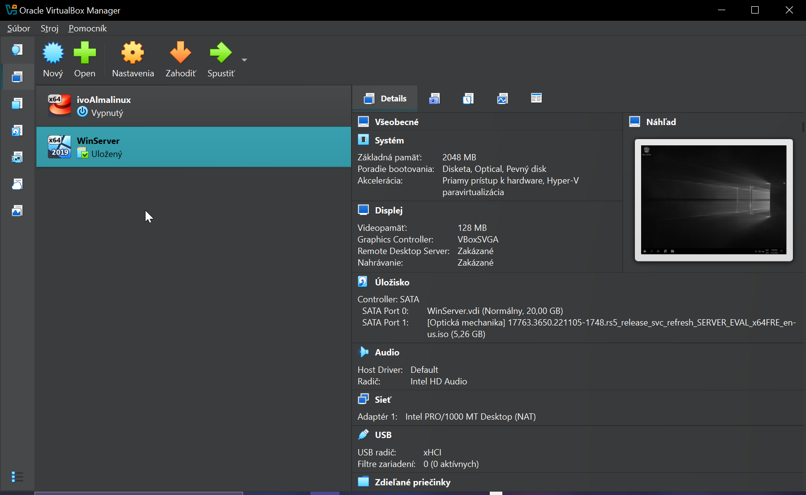

### Domain Controller network configuration
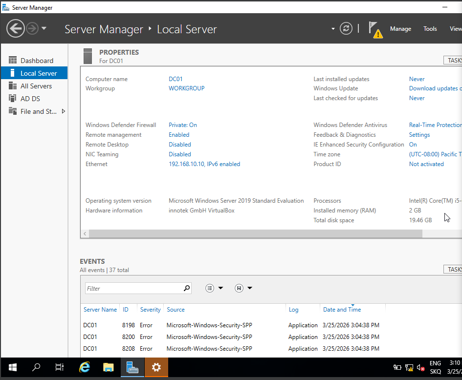

### Server Manager
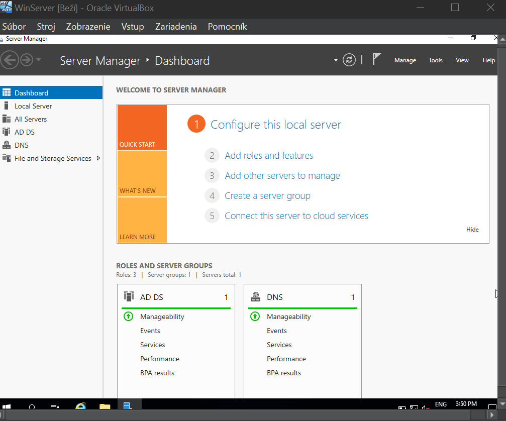

### User created in Active Directory
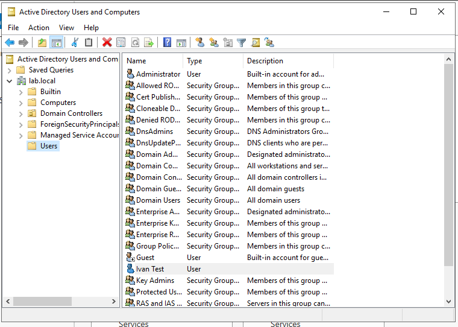

### Organizational Units (OU)
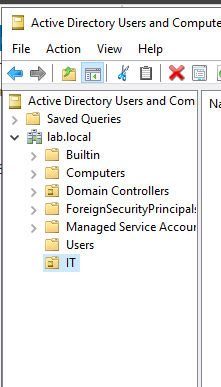
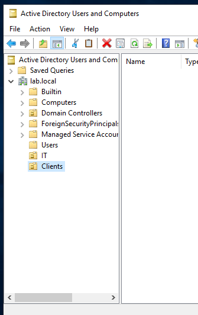

### Network configuration
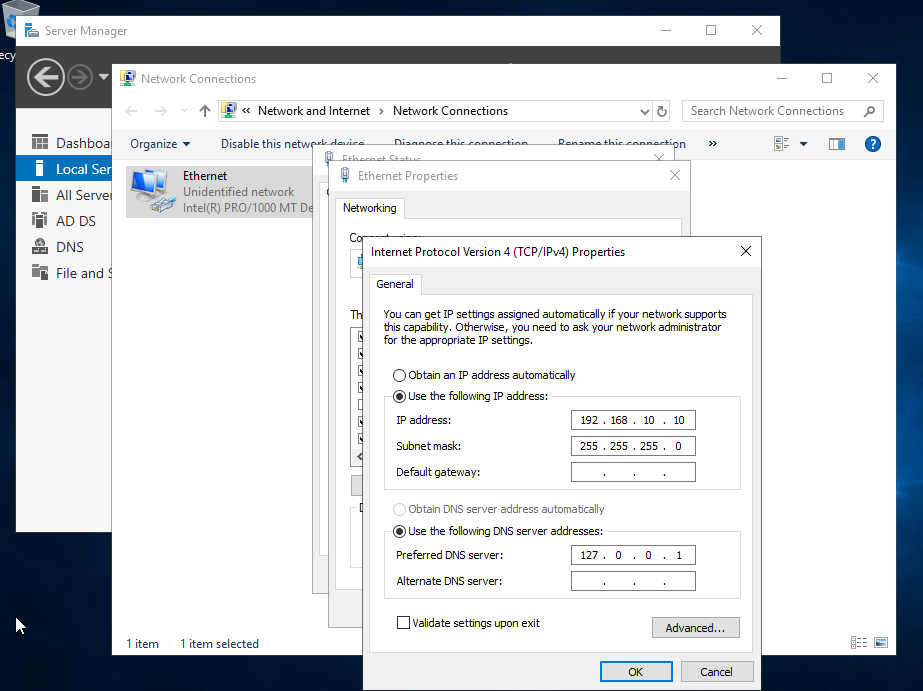
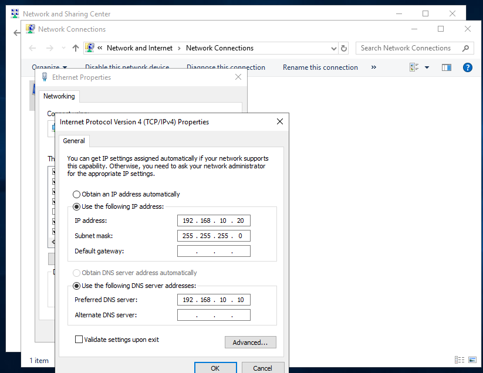

### Domain join
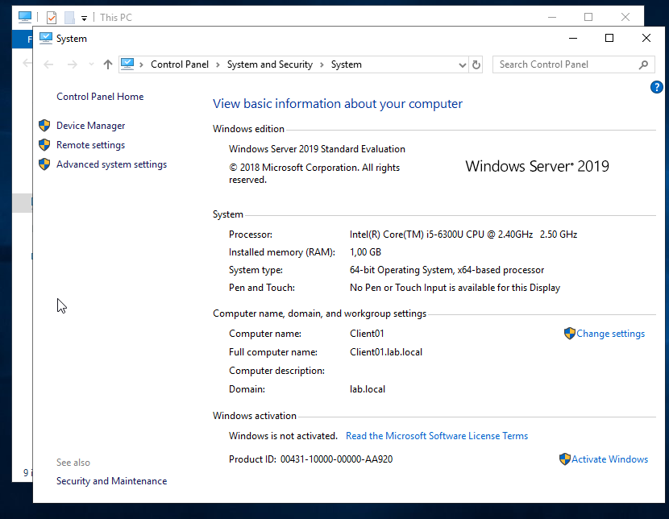

### User login
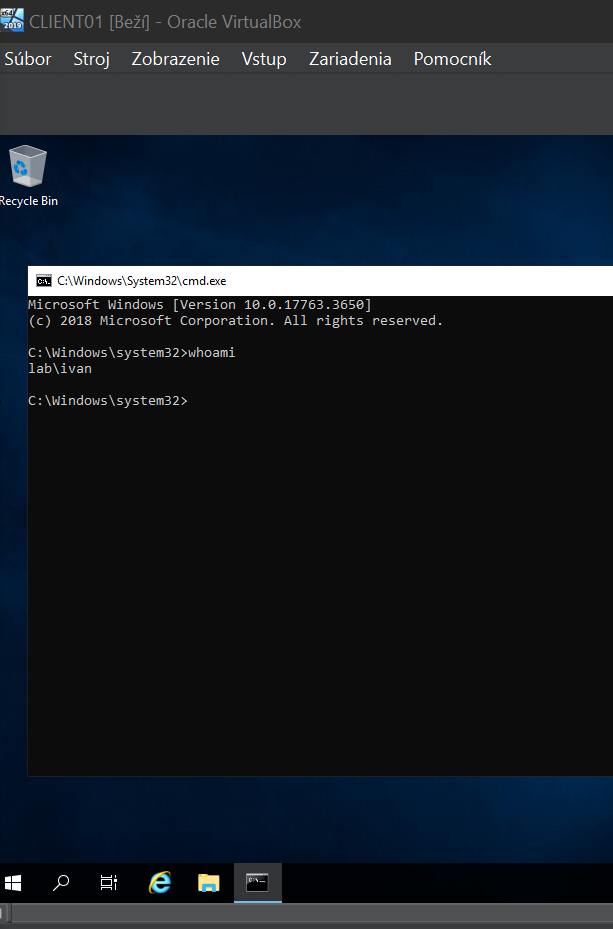

### Group Policy configuration
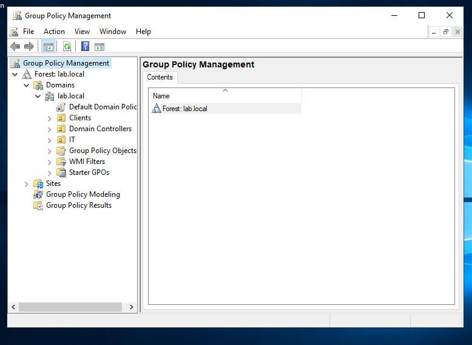
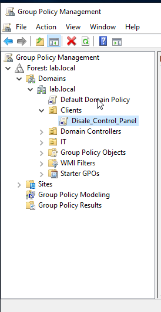
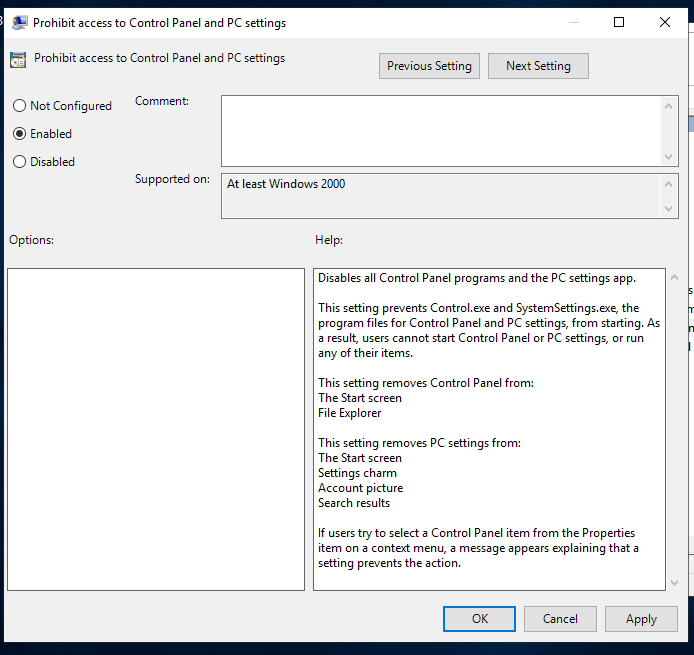

### Result (policy applied)
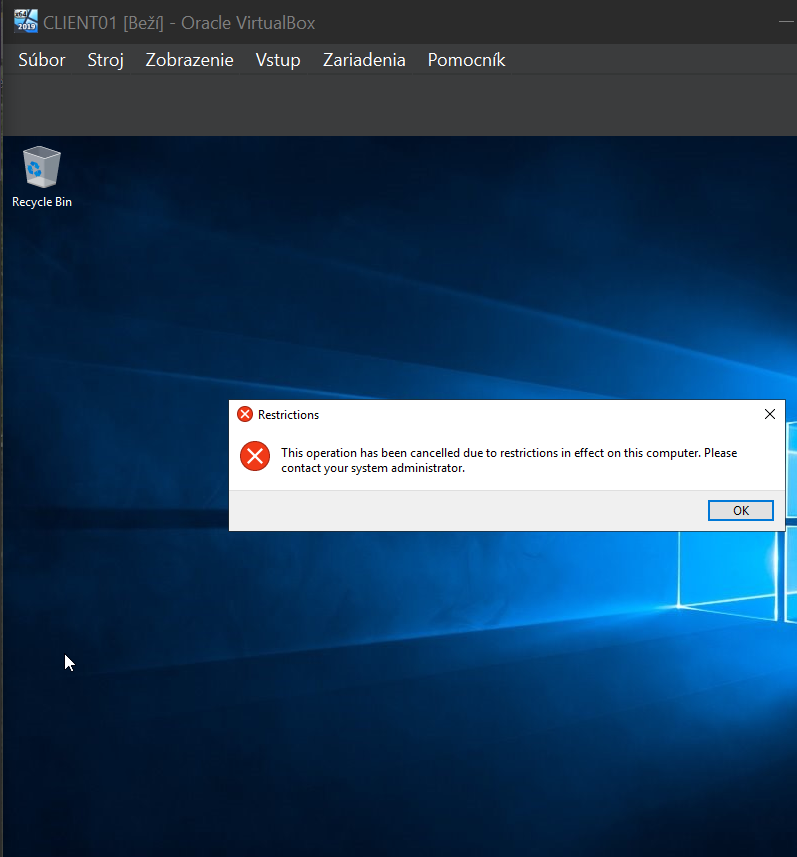

## ✅ Result

User access to Control Panel was successfully restricted using Group Policy, confirming correct GPO configuration and application.
